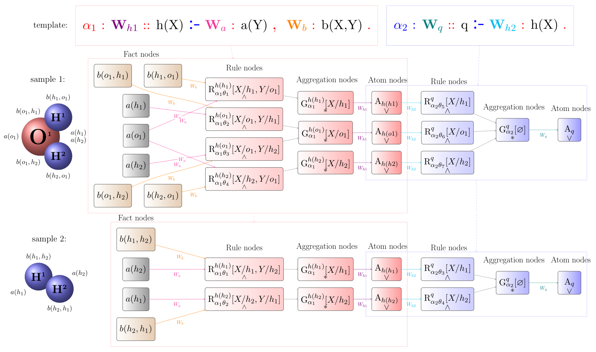
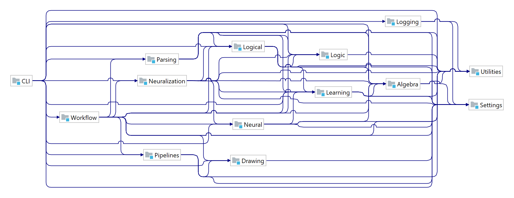

# NeuraLogic
[](https://github.com/GustikS/NeuraLogic/actions/workflows/maven.yml)
[](https://github.com/GustikS/NeuraLogic/releases)
[](https://javadoc.io/doc/io.github.gustiks/Neural/latest/index.html)
[](https://github.com/GustikS/NeuraLogic/blob/master/LICENSE)
[](https://adoptopenjdk.net/index.html?variant=openjdk8&jvmVariant=hotspot)


_Integrating **deep** and **relational** learning through **differentiable logic programming**._

- This is the official implementation of the concept of [Deep Learning with Relational Logic Representations](https://www.iospress.com/catalog/books/deep-learning-with-relational-logic-representations)
- instantiated through the framework of [Lifted Relational Neural Networks](https://jair.org/index.php/jair/article/view/11203)
- This is the (Java) backend, you can find Python frontend at [**PyNeuralogic**](https://github.com/LukasZahradnik/PyNeuraLogic) 

---
 
## About

At the core of the framework, there is a custom [language](./Parsing/src/main/java/cz/cvut/fel/ida/logic/parsing/antlr/grammars/Neuralogic.g4) you can use to write differentiable programs encoding your learning scenarios, similarly to classic Deep Learning (DL) frameworks (e.g. TensorFlow). However, the language follows a [logic programming](https://en.wikipedia.org/wiki/Logic_programming) paradigm and is **declarative** in nature (it's similar to [Datalog](https://en.wikipedia.org/wiki/Datalog)). This means that instead of directly encoding the computation graph, you just _declare_:

1. the _inputs_ (and their numeric values, if any)
    - i.e. the observed facts/data = objects, structures, knowledge graphs, relational databases, ...
    - e.g. `atom(oxygen_1)`, `0.3 stable(oxygen)`, `8 protons(oxygen)`, `1.7 energy(oxygen,leve2)`, `[1.2,0,-1] features(oxygen)`, `[[0,2.1],[1.7,-1]] bond(oxygen_1,hydrogen_2,covalent_1)`
1. the _outputs_ (and their expected values - for supervised learning)
    - i.e. the queries = classification labels, regression targets, ...
    - e.g. `1 class`, `4.7 target(molecule_3)`, `0 relation(carbon,xenon,fluor)`
1. a set of _rules_ applicable in your domain (and their learnable parameters `W`)
    - i.e. the generic prior/knowledge/bias which you want to use.
        - these rules will be used to (automatically) infer (link) the outputs from the inputs
    - e.g. explicit/interpretable rules such as `0.99 covalent(B) <= oxygen(X), hydrogen(Y), bond(X,Y,B).`
    - or  more implicit/flexible concepts such as `embed(X) <= W_1 embed(Y), bond(X,Y,_).`
        - with these you can easily encode a lot of diverse structured deep learning models!

### Example
Consider a simple program for learning with molecular data<sup>[1](#myfootnote1)</sup>, encoding a generic idea that some hidden representation (predicate `h(.)`) of any chemical atom (variable `X`) is somewhat dependent on the other atoms (`a(Y)`) bound to it (`b(X,Y)`), with a parameterized rule as:
```prolog
W_h1 h(X) <= W_a a(Y), W_b b(X,Y).
```
Additionally, let's assume that representation of a molecule (`q`) follows from representations of all the contained atoms (`h(X)`), i.e.:
```prolog
W_q q <= W_h2 h(X).
```
These 2 rules, parameterized with the tensors `W_*`'s, then form a _learning program_, which can be used to classify molecules. Actually, it directly encodes a popular idea known as [Graph Neural Networks](https://distill.pub/2021/gnn-intro).
Execution of this program ("template") for 2 input molecule samples will generate 2 parameterized computational graphs as follows:



Each computation node in the graphs is associated with some (differentiable) activation function defined by a user (or settings). 
The parameters `W_*` in the program are then automatically optimized to reflect the expected output values (`A_q`) through gradient descent.

---

For detailed syntax and semantics, please check out the concept of "[*Lifted Relational Neural Networks*](https://arxiv.org/abs/2007.06286)". For a deep dive into the principles in full scientific context, please see my [dissertation thesis](https://gustiks.github.io/files/dissertation.pdf) or the book on [Deep learning with relational logic representations](https://www.iospress.com/catalog/books/deep-learning-with-relational-logic-representations).

---

<a name="myfootnote1">1</a>: _Note that NeuraLogic is by no means designed or limited to learning with chemical data/models/knowledge, but we use it as an example domain here for consistency._

## Use Cases
While the framework can be used to encode anything from MLPs, CNNs, RNNs, etc., it is **not** well suited for classic deep learning with regular data based on large homogeneous tensor operations.
The framework is rather meant for efficient encoding of deep **relational** learning scenarios<sup>[2](#myfootnote2)</sup>, i.e. using dynamic (weight-sharing) neural networks to learn from data with _irregular_ structure(s). 
That is why we exploit the declarative language with first-order expressiveness, as it allows for compact encoding of complex relational scenarios (similarly to how [Prolog](https://en.wikipedia.org/wiki/Prolog) can be elegant for relational problems, while not so much for classic programming).

The framework is mostly optimized for quick, high-level prototyping of learning scenarios with sparse, irregular, relational data and complex, dynamically structured models. Particularly, you may find it beneficial for encoding various:
  - Graph neural networks
    - where you can use it to go well [beyond the existing models](https://arxiv.org/abs/2007.06286)
  - Knowledge base completions
    - with [complex models](https://link.springer.com/chapter/10.1007/978-3-319-63342-8_9) requiring e.g. chained inference
  - learning with Relational background knowledge/bias
    - which can be as expressive as the [models themselves](https://www.jair.org/index.php/jair/article/view/11203)
  - approaches from Neural-symbolic integration
    - for combining (fuzzy) [logic inference with neural networks](http://arg.ciirc.cvut.cz/slides/2016-Sourek-LRNN.pdf)
  - and other more crazy ideas, such as learning with
    - hypergraphs and ontologies
        - see [example constructs](https://arxiv.org/abs/2007.06286)
    - recursion
        - e.g. for [latent type hierarchies](https://link.springer.com/chapter/10.1007/978-3-319-63342-8_9)
    - and generic [latent logic programs](https://link.springer.com/chapter/10.1007/978-3-319-78090-0_10)


<a name="myfootnote2">2</a>: _if you come from deep learning background, you may be familiar with related terms such as "Geometric deep learning" or "Graph representation learning" (but this framework is not limited to graphs only)._

## Getting started

##### Prerequisite

```
Java ≥ 1.8 
```

   - [continuously tested](https://github.com/GustikS/NeuraLogic/actions) with JDK 1.8 on the latest Ubuntu, Windows and macOS<sup>[3](#myfootnote3)</sup>

#### Running examples

1. download a [release](https://github.com/GustikS/NeuraLogic/releases) into some directory `DIR`
    - or [build from source](https://github.com/GustikS/NeuraLogic/blob/master/.github/workflows/maven.yml) with [Maven](https://maven.apache.org/) or [IntelliJ IDEA](https://www.jetbrains.com/idea/)
1. clone this repository (or just download the Resources/datasets directory) within `DIR`
    - `git clone https://github.com/GustikS/NeuraLogic`
1. try some trivial examples from terminal in `DIR`
    1. a simple familiar XOR problem
        - scalar: `java -jar NeuraLogic.jar -sd ./NeuraLogic/Resources/datasets/neural/xor/naive`
        - vectorized: `java -jar NeuraLogic.jar -sd ./NeuraLogic/Resources/datasets/neural/xor/vectorized`
    1. a simple relational problem (Example 2 from [this paper](https://www.jair.org/index.php/jair/article/view/11203))
        - `java -jar NeuraLogic.jar -sd ./NeuraLogic/Resources/datasets/simple/family`
    1. molecule classification problem ([mutagenesis](https://www.doc.ic.ac.uk/~shm/mutagenesis.html))
        - `java -jar NeuraLogic.jar -sd ./NeuraLogic/Resources/datasets/relational/molecules/mutagenesis -ts 100`
    1. knowledge-base completion problem ([countries](https://www.aaai.org/ocs/index.php/SSS/SSS15/paper/viewPaper/10257))
        - `java -jar NeuraLogic.jar -sd ./NeuraLogic/Resources/datasets/relational/kbs/nations`
1. you can check various exported settings and results in `DIR/target`
    1. if you have [Graphviz](https://graphviz.org/download/) installed (`which dot`), you can observe the internal computation structures in debug mode:
        - `java -jar NeuraLogic.jar -sd ./NeuraLogic/Resources/datasets/neural/xor/naive -iso -1 -prune -1 -debug all`
            - this should show a graph of the 1) worflow, 2) template, 3) inference graphs, 4) neural networks + weight updates, and 5) final learned template
        - `java -jar NeuraLogic.jar -sd ./NeuraLogic/Resources/datasets/simple/family -iso -1 -prune -1 -debug all`
            - note we turn off network pruning and compression here so that you can observe direct correspondence to the original example  


---
<a name="myfootnote3">3</a>: _if you don't have Java in your system already, get it either from [Oracle](https://www.oracle.com/java/technologies/javase-jre8-downloads.html) or [OpenJDK](https://adoptopenjdk.net/index.html?variant=openjdk8&jvmVariant=hotspot)_
   - for simple usage, it is enough to get the runtime environment (JRE)
   - for developers - you can clone and open this project directly in [IntelliJ IDEA](https://www.jetbrains.com/idea/)

<!-- (both OpenJDK (≥ v1.8.0_222) and Oracle JDK (≥ v1.8.0_151) will do). -->

### Usage
```
usage: java -jar NeuraLogic.jar 

 -lc,--logColors <INT>                   colored output on console, best on white background {0,INT} (default: 1)
 -sf,--sourcesFile <FILE>                path to json Sources specification file (default: sources.json)
 -sd,--sourcesDir <DIR>                  path to directory with all the standardly-named Source files for learning (default: .)
 -t,--template <FILE>                    Template file containing weighted rules for leaning (default: template.txt)
 -q,--trainQueries <FILE>                file containing labeled training Queries (default: trainQueries.txt)
 -e,--trainExamples <FILE>               file containing, possibly labeled, input training Facts (default: trainExamples.txt)
 -vq,--valQueries <FILE>                 file containing labeled validation Queries (default: valQueries.txt)
 -ve,--valExamples <FILE>                file containing, possibly labeled, input validation Facts (default: valExamples.txt)
 -te,--testExamples <FILE>               file with, possibly labeled, test Examples (default: testExamples.txt)
 -tq,--testQueries <FILE>                file with test Queries (default: testQueries.txt)
 -fp,--foldPrefix <STRING>               folds folder names prefix (default: fold_)
 -xval,--crossvalidation <INT>           number of folds to split for crossvalidation (default: 5)
 -set,--settingsFile <FILE>              path to json file with all the Settings (default: settings.json)
 -out,--outputFolder <DIR>               output folder for logging and exporting (default: ./target/out)
 -mode,--pipelineMode <ENUM>             main mode of the program {complete, neuralization, debug} (default: complete)
 -debug,--debugMode <ENUM>               debug some objects within the Pipeline during the run {template, grounding, neuralization, samples, model, all} (default: all)
 -lim,--limitExamples <INT>              limit examples to some smaller number, used e.g. for debugging {-1,INT} (default: -1)
 -seed,--randomSeed <INT>                int seed for random generator (default: 0)
 -gm,--groundingMode <ENUM>              groundings mode {independent, sequential, global} (default: independent)
 -dist,--distribution <ENUM>             distribution for weight initialization {uniform, normal, longtail, constant} (default: uniform)
 -init,--initialization <ENUM>           algorithm for weight initialization {simple, glorot, he} (default: simple)
 -opt,--optimizer <ENUM>                 optimization algorithm {sgd, adam} (default: ADAM)
 -lr,--learningRate <FLOAT>              initial learning rate (default: 0.001)
 -ts,--trainingSteps <INT>               cumulative number of epochae in neural training (default: 3000)
 -rec,--recalculationEpocha <INT>        recalculate true training and validation error+stats every {INT} epochae (default: 10)
 -decay,--learnRateDecay <FLOAT>         learning rate decay geometric coefficient {-1,FLOAT} (default: 0.95)
 -decays,--decaySteps <INT>              learning rate decays every {-1,INT} steps (default: 100)
 -preft,--preferTraining <INT>           turn on to force best training model selection as opposed to (default) selecting best validation error model {0,1} (default: 0)
 -atomf,--atomFunction <ENUM>            activation function for atom neurons {sigmoid,tanh,relu,identity,...} (default: tanh)
 -rulef,--ruleFunction <ENUM>            activation function for rule neurons {sigmoid,tanh,relu,identity,...} (default: tanh)
 -aggf,--aggFunction <ENUM>              aggregation function for aggregation neurons {avg,max,sum,...} (default: avg)
 -em,--evaluationMode <ENUM>             evaluation metrics are either for {regression, classification, kbc} (default: classification)
 -ef,--errorFunction <ENUM>              type of error function {MSE, XEnt} (default: AVG(SQUARED_DIFF))
 -iso,--isoCompression <INT>             iso-value network compression (lifting), number of decimal digits (default: 12)
 -isoinits,--isoInitializations <INT>    number of iso-value initializations for network compression (default: 1)
 -isocheck,--losslessCompression <INT>   lossless compression isomorphism extra check? {0,1} (default: 0)
 -prune,--chainPruning <INT>             linear chain network pruning {0,1} (default: 1)
```
    
## Maven Dependency

To integrate within your project, you can import as a dependency directly from Maven central or Github packages.

```xml
<dependency>
  <groupId>io.github.gustiks</groupId>
  <artifactId>neuralogic-cli</artifactId>
  <version>0.3.0</version>
</dependency>
```

For the above shown usage, the [Main class](https://github.com/GustikS/NeuraLogic/blob/master/CLI/src/main/java/cz/cvut/fel/ida/neuralogic/cli/Main.java) in the CLI module is your starting point.


### Modules

Note that this is a multi-module [Maven project](https://maven.apache.org/guides/introduction/introduction-to-the-standard-directory-layout.html) (with a parent [pom.xml](./pom.xml)). Hence, you can also choose to use the submodules independently (e.g. 'Algebra' for simple math, 'Logic' for first-order inference, 'Neural' for deep learning in Java, 'Pipelines' for creating "MLOps" workflows, etc.). 


| Module        | Description                                                            |
|---------------|------------------------------------------------------------------------|
| Algebra       | value definitions (scalar/vector/matrix...) with respective mathematical operations and functions |
| CLI           | simple command line interface to the framework, based on Apache commons' [CLI](http://commons.apache.org/proper/commons-cli/) |
| Drawing       | visualization of templates, inference and neural networks, based on DOT language ([Graphviz](https://graphviz.org/))                 |
| Frontend      | Python scripts for calling some high-level functionalities, reading results, and exporting neural nets to [Dynet](http://dynet.io/), based on [Py4J](https://www.py4j.org/) (moved to [PyNeuralogic](https://github.com/LukasZahradnik/PyNeuraLogic))|
| Learning      | high-level (supervised) machine learning definitions and functions |
| Logging       | simple logging + (color) formatting, based on the default java.util.logging library |
| Logic         | subsumption engine providing efficient relational logic grounding, credit to [Ondrej Kuzelka](https://github.com/supertweety) |
| Logical       | the logical part of the integration containing logic-based structures and computation - i.e. weighted logic grounding, extension of the Logic module |
| Neural        | the neural part of the integration containing neural-based structures and computation - i.e. neural nets processing, backprop and classic DL stuff |
| Neuralization | the process of conversion from the logical to the neural structures |
| Parsing       | definition and parsing of the NeuraLogic language into internal representation, based on [ANTLR](https://www.antlr.org/)  |
| Pipelines     | high-level "MLOps" library for creating generic ML workflows (custom made) |
| Resources     | test resources, templates, datasets, etc.  |
| Settings      | central configuration/validation of all settings and input sources (files) |
| Utilities     | generic utilities (maths, java DIY, etc.), with [Gson](https://github.com/google/gson) serialization and [JMH](https://openjdk.java.net/projects/code-tools/jmh/) benchmarking |
| Workflow      | NeuraLogic-specific building blocks for typical ML worflows, based on the Pipelines module |



## Papers

[Beyond Graph Neural Networks with Lifted Relational Neural Networks](https://arxiv.org/abs/2007.06286) Machine Learning Journal, 2021
 - also presented at [IJCLR 2021](http://lr2020.iit.demokritos.gr/accepted/index.html) and [AAAI 2023](https://underline.io/lecture/69510-beyond-graph-neural-networks-with-lifted-relational-neural-networks)

[Lossless compression of structured convolutional models via lifting](https://arxiv.org/abs/2007.06567) ICLR, 2021

[Lifted Relational Neural Networks](https://arxiv.org/abs/1508.05128) Journal of Artificial Intelligence Research, 2018

[Stacked structure learning for lifted relational neural networks](https://link.springer.com/chapter/10.1007/978-3-319-78090-0_10) Inductive Logic Programming, 2017

[Learning predictive categories using lifted relational neural networks](https://link.springer.com/chapter/10.1007/978-3-319-63342-8_9) Inductive Logic Programming, 2016

[Lifted Relational Neural Networks (short version)](http://ceur-ws.org/Vol-1583/CoCoNIPS_2015_paper_7.pdf) Cognitive Computing workshop @NIPS, 2015

### Books

[Deep Learning with Relational Logic Representations](https://www.iospress.com/catalog/books/deep-learning-with-relational-logic-representations) (2022)
- A book providing full context for the framework, based on my (freely available) [dissertation thesis](https://gustiks.github.io/publication/dissertation)

#### Chapters

[Lifted Relational Neural Networks: From Graphs to Deep Relational Learning](https://ebooks.iospress.nl/doi/10.3233/FAIA230147) (2023)
- A book chapter about the framework in the [Compendium of Neurosymbolic Artificial Intelligence](https://www.iospress.com/catalog/books/compendium-of-neurosymbolic-artificial-intelligence)

<!--
Googling "**Lifted Relational Neural Networks**" should give you a [short paper](http://ceur-ws.org/Vol-1583/CoCoNIPS_2015_paper_7.pdf) from a NIPS workshop on cognitive computation 2015,
and its [long version](https://www.jair.org/index.php/jair/article/view/11203) from Journal of Artificial Intelligence Research, 2018. The most up-to-date description of the framework then views it as a [generalization of Graph Neural Networks](https://arxiv.org/abs/2007.06286).

Further, you can find applications and extensions, including declarative [learning scenarios](https://link.springer.com/chapter/10.1007/978-3-319-63342-8_9) (ILP 2016) and inductive [structure learning](https://link.springer.com/chapter/10.1007/978-3-319-78090-0_10) (ILP 2017) of the learning programs. The most complete description of the work in its full context can then be found in my [dissertation thesis](https://gustiks.github.io/files/dissertation.pdf).
-->

## Videos
[IJCLR 2021 joint session](https://www.youtube.com/watch?v=-5h-h0ukXk0&list=PL18_rB75vx1PkjXnkX1jiqNeNnVCbNGIh&index=39)

[ICLR 2021](https://slideslive.com/38954203/lossless-compression-of-structured-convolutional-models-gnns-via-lifting)

[NIPS CoCo workshop 2015](https://www.bilibili.com/video/av66440677/)

[Prague Machine learning meetups 2017](https://www.youtube.com/watch?v=LHj8M8SV1zA)

<!--
###### Presentations

[Prague Automated Reasoning Seminar 2016](http://arg.ciirc.cvut.cz/slides/2016-Sourek-LRNN.pdf)
-->

#### Related Repositories

Much of the Logic and Utils modules comes from [Ondrej Kuzelka's](https://github.com/supertweety/) repositories [Logic](https://github.com/supertweety/Logic) and [Utils](https://github.com/supertweety/Utils)

For experiments from the paper "Beyond GNNs with LRNNs" (2020), please see a [GNNwLRNNs repository](https://github.com/GustikS/GNNwLRNNs).

For experiments from the paper "Lossless Compression of Structured Convolutional Models via Lifting" (2020), please see a [NeuraLifting repository](https://github.com/GustikS/NeuraLifting).

<!--
### Upcoming

- Documentation wiki
- Python API
    - a more user friendly frontend
    - plus integration to popular DL libraries
- Lambda calculus support in the language
- Migrating structure learning module from the previous version
-->

#### Disclaimer
This is a second generation of the framework<sup>[4](#myfootnote4)</sup>, but it is still work in (very slow) progress.
The framework is meant for academic purposes, developed at [Intelligent Data Analysis lab](https://ida.fel.cvut.cz/) at Czech Technical University in Prague.
In case of any questions or anything interesting, feel free to contact me at *souregus@gmail.com*, but please do not expect any sort of professional software support. 
<!--
If you are looking for something more conservative and user friendly, consider [PyG](https://pytorch-geometric.readthedocs.io/en/latest/notes/installation.html) or [DGL](https://www.dgl.ai/pages/start.html) for the graph-based learning use cases.
-->
<a name="myfootnote4">4</a>: _for reference, you can find previous implementation (2014-2018) in [this repository](https://github.com/GustikS/Neurologic)_
